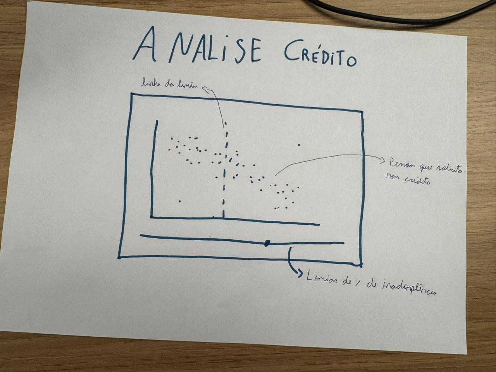
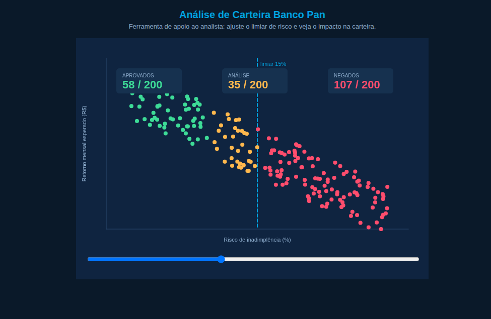

# Microinterface — Análise de Carteira de Crédito

## 1. Quem é o usuário desta microinterface

O usuário-alvo **não é o cliente final** que recebe o cartão. É o **analista de dados / analista de crédito** do Banco Pan — a pessoa responsável por:

- validar o comportamento do modelo sobre a carteira;
- calibrar a **política de crédito** (até que nível de risco o banco aceita aprovar);
- justificar decisões de concessão para áreas de produto, risco e auditoria.

Essa microinterface foi pensada para o dia a dia desse perfil.

---

## 2. O problema que estamos resolvendo

Hoje, calibrar uma política de crédito é um trabalho que acontece principalmente em **planilha ou notebook Python**: o analista define um limiar de risco, roda o script, exporta o resultado, gera um gráfico estático, analisa e repete. O ciclo é lento, e o gráfico final é "morto" — quem olha depois não consegue manipulá-lo.

Além disso, decisões de crédito quase sempre precisam ser explicadas para **outras áreas que não dominam estatística** (produto, comercial, diretoria, auditoria). Tabelas e métricas abstratas dificultam essa conversa.

---

## 3. Rascunho Microinterface

## 3.1 Microinterface Final

## 4. O que esta microinterface entrega

Uma **visualização interativa da carteira** em formato de gráfico de dispersão: cada ponto é um cliente, posicionado por **risco de inadimplência (eixo X)** e **retorno mensal esperado (eixo Y)**.

O analista controla um único slider: o **limiar de risco aceito** pelo banco. Ao mover o slider:

- os pontos mudam de cor em tempo real (verde = aprovado, amarelo = análise manual, vermelho = negado);
- três KPIs no topo mostram a contagem de cada faixa;
- a linha tracejada azul marca o ponto de corte atual.

A carteira inteira reage instantaneamente à decisão do analista.

---

## 5. Como isso entrega valor ao usuário

### 5.1 Feedback imediato sobre o trade-off
A pergunta clássica do analista — *"e se a gente aceitar até 18% de risco?"* — costuma levar minutos para ser respondida (rodar script, regerar gráfico). Aqui, ela é respondida em **2 segundos**, arrastando o slider. Isso encurta drasticamente o ciclo entre hipótese e decisão.

### 5.2 Visibilidade da zona cinzenta
O gráfico de dispersão expõe os **clientes fronteiriços** — aqueles que mudam de classificação com pequenas variações no threshold. Em tabela ou métrica agregada, esse grupo fica invisível. No gráfico, ele salta aos olhos: é onde a política precisa ser mais cuidadosa.

### 5.3 Linguagem visual para reuniões com stakeholders
Em conversa com produto, risco ou diretoria, o analista não precisa explicar "o ponto de corte do modelo". Ele move o slider ao vivo e a discussão passa a ser sobre o **trade-off real** (mais aprovação vs. mais inadimplência), não sobre métricas estatísticas abstratas.

### 5.4 Apoio à explicabilidade
Quando um cliente é negado, o analista pode mostrar visualmente onde ele se localiza na carteira: *"caiu aqui, do lado vermelho da linha"*. É um argumento tangível para auditoria interna, ouvidoria e justificativas para áreas de negócio.

### 5.5 Em uma frase
> A microinterface transforma a calibração de política de crédito de um exercício de planilha em uma exploração visual e interativa, encurtando o ciclo entre hipótese e decisão e tornando o trade-off risco × retorno tangível para todos os stakeholders.

---

## 6. Enquadramento na atividade

A proposta combina três das categorias sugeridas no enunciado:

- **painel de controle e ajustes do algoritmo** — o slider permite ao analista ajustar um parâmetro de decisão;
- **visualização interativa dos resultados** — a dispersão mostra o efeito sobre a carteira;
- **simulação de cenários de uso** — cada posição do slider representa um cenário de política de crédito.

## 7. Notas técnicas

- **Dados:** a carteira mostrada é **sintética** (200 clientes gerados com `randomSeed(42)` para reprodutibilidade). Não há dados reais do Banco Pan envolvidos. A geração foi calibrada para reproduzir o padrão esperado: clientes de menor risco tendem a ter maior retorno esperado, com dispersão natural.
- **Classificação:** o sketch usa uma regra simples para fins de demonstração — clientes com risco até `limiar − 5%` são aprovados, entre `limiar − 5%` e `limiar` vão para análise manual, e acima do limiar são negados. Essa zona de 5% representa a faixa de incerteza típica que costuma ir para revisão humana.
- **Limitações conscientes:** o protótipo não está integrado ao backend real do projeto. Ele é, intencionalmente, um **exploratório visual** — feito para inspirar o desenho da interface final que apoiará o analista na apresentação do projeto.

---

## 10. O que esse protótipo inspira para a apresentação final

- Um **painel de calibração** integrado ao dashboard de monitoramento da carteira.
- Uma tela de **explicabilidade individual** — clicar em um ponto e ver o detalhe do cliente, justificando sua classificação.
- Filtros adicionais (faixa de renda, score, idade) que permitam ao analista explorar **subcarteiras** com a mesma lógica de what-if.